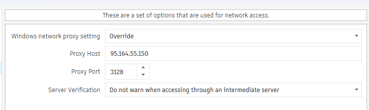
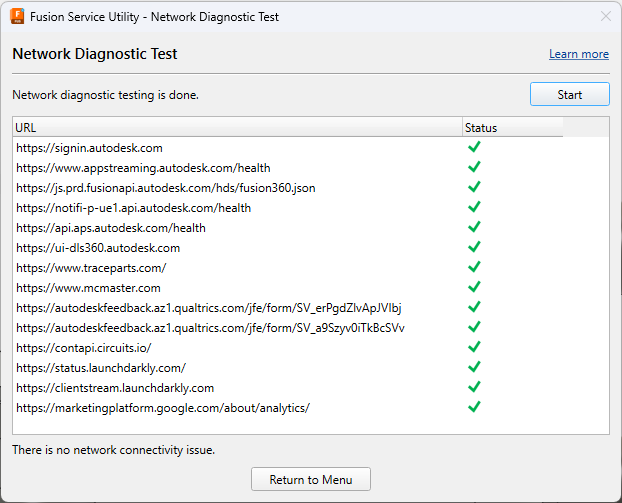

# Fusion-proxy

HTTP forward proxy для Autodesk Fusion 360. Fusion не умеет SOCKS и не ходит в облако напрямую из ряда сетей — нужен промежуточный сервер с выходом в интернет по HTTPS. Этот репозиторий разворачивает такой сервер: `mitmdump` в режиме passthrough (без подмены сертификатов), слушает порт 3128, пропускает трафик клиента к Autodesk и смежным сервисам.

Главная цель — чтобы Fusion выходил в онлайн. Критичный endpoint: `https://api.aps.autodesk.com/health`. Без него Network Diagnostic Test падает и приложение не считает сеть рабочей. На datacenter IPv4 этот health часто отвечает 403; на IPv6 — 200. Прокси должен работать на хосте с IPv6 egress (native systemd, не Docker bridge). Остальные URL из диагностики (signin, appstreaming, fusionapi, PubNub) тоже должны проходить, но APS — первый блокер.

Fusion использует два способа обращения к proxy: CONNECT для большинства HTTPS и `GET https://…` для PubNub long-poll. Squid на GnuTLS второй способ ломает; mitmproxy с `--ignore-hosts '.*'` обрабатывает оба. TLS interception для Autodesk запрещён — sign-in и APS отвергают подменённые сертификаты.

## Как это выглядит у клиента

Windows system proxy и Fusion Preferences → Network должны указывать на один адрес. Data Panel и sign-in берут системный proxy из Chromium, одной настройки в Fusion недостаточно.

Override, Proxy Host — IP вашего сервера, Proxy Port — 3128, Server Verification — «Do not warn when accessing through an intermediate server».

После развёртывания: Fusion Service Utility → Network Diagnostic Test. Все пробы, включая `api.aps.autodesk.com/health`, должны быть зелёными.

## Развёртывание на своём сервере

Нужен Linux-сервер (Debian/Ubuntu подойдут) с публичным IPv4, рабочим IPv6 на outbound, открытым inbound TCP 3128 и исходящим 80/443. Root или sudo для systemd и `/usr/local/bin`.

Скопируйте репозиторий на сервер, например в `/root/fusion-proxy`. Установите бинарник mitmproxy той же версии, что в файле `VERSION`: `./scripts/install.sh`. Скопируйте unit: `cp systemd/fusion-proxy.service /etc/systemd/system/`, затем `systemctl daemon-reload && systemctl enable --now fusion-proxy`. Конфиг — `config/mitmproxy.env` (порт, режим, ignore-hosts). Проверка: `./scripts/verify.sh` — APS health, PubNub GET, signin должны вернуть 200; listener — `mitmdump` на :3128.

Обновление версии: `./scripts/install.sh <version>` и `systemctl restart fusion-proxy`. Логи: `journalctl -u fusion-proxy -f`.

Полный allowlist доменов Fusion и детали требований — в [docs/deployment-guide.md](docs/deployment-guide.md).

## Структура репозитория

`VERSION` — pin mitmproxy. `config/mitmproxy.env` — параметры запуска. `systemd/fusion-proxy.service` — unit для systemd. `scripts/install.sh` — загрузка standalone binary с snapshots.mitmproxy.org. `scripts/verify.sh` — smoke-тесты с сервера. `docs/` — гайд и скриншоты.

## Кратко о потоке

Клиент Fusion на Windows шлёт HTTP proxy-запросы на `SERVER:3128`. mitmdump на сервере устанавливает исходящие соединения к целевым хостам (через IPv6 где нужно для APS), TLS не расшифровывает. Ответы возвращаются клиенту как через обычный forward proxy.
