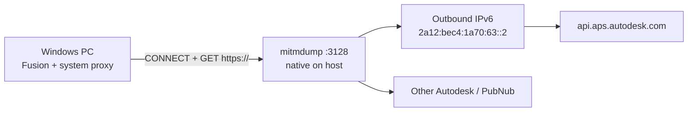

# Autodesk Fusion — Proxy Deployment Guide

Reference for a self-hosted HTTP forward proxy for Fusion 360: requirements, deployed architecture, domain allowlist, client setup, verification.

Project root: `/root/fusion-proxy/`

---

## 0. Deployed instance (95.164.55.150)

| Parameter | Value |
|-----------|-------|
| Host | NL exit node `95.164.55.150` |
| Proxy | **mitmproxy** standalone binary (`mitmdump`), **passthrough** (no TLS MITM) |
| Version | see `/root/fusion-proxy/VERSION` |
| Listen | `0.0.0.0:3128` |
| Auth | None |
| Service | `fusion-proxy.service` → `/usr/local/bin/mitmdump` |
| Config | `/root/fusion-proxy/config/mitmproxy.env` |
| Logs | `journalctl -u fusion-proxy -f` |



**Why mitmproxy, not Squid.** Fusion uses two proxy methods:

| Method | Used for | Squid (GnuTLS) | mitmproxy (passthrough) |
|--------|----------|----------------|-------------------------|
| `CONNECT` | Most HTTPS (Autodesk APIs) | OK | OK |
| `GET https://…` | PubNub long-poll | 502 | OK |

**Why native on host (not Docker).** `api.aps.autodesk.com/health` returns **403 on IPv4**, **200 on IPv6** (Google WAF). Process runs on host network stack — IPv6 egress preserved without `--network host` wrapper.

**TLS.** `--ignore-hosts '.*'` — no certificate substitution. Mandatory for Autodesk sign-in and APS.

**Coexistence.** `microsocks` on `10.10.10.1:1080` (AWG/ValleyTalk SOCKS exit) is separate; Fusion does not use it.

---

## 1. Proxy requirements (Fusion)

| Requirement | Detail |
|---|---|
| **Type** | HTTP/HTTPS **forward proxy**. SOCKS is not configurable in Fusion's Network dialog. |
| **CONNECT** | **Mandatory** for most HTTPS traffic. |
| **GET https://** | **Mandatory** for PubNub (`pubsub.pubnub.com`). Not all proxies support this. |
| **Authentication** | None or **Basic** only. NTLM / Kerberos / Negotiate break Fusion features. |
| **TLS interception** | **Do not MITM** Autodesk hosts. Tunnel transparently. |
| **IPv6 egress** | Required for `api.aps.autodesk.com` on datacenter hosts. |
| **System proxy** | Data Panel and sign-in use **Windows system proxy**, not only Fusion Preferences. |

---

## 2. Required ports

Outbound from proxy host: **80**, **443**.  
Inbound to proxy: **TCP 3128** (client → `95.164.55.150`).

---

## 3. Required domains

### 3.1 Unrestricted (anonymous) access — required for installation

- `*.autodesk.com`
- `*.autodesk360.com`
- `*.cloudfront.net`

```
*.autodesk.com; *.autodesk360.com; *.cloudfront.net
```

### 3.2 Contacted during normal operations

- `*.akamai.com`, `akamaitechnologies.com`, `*.amazonaws.com`, `api.hcaptcha.com`, `damassets.net`, `google-analytics.com`, `googletagmanager.com`, `*.launchdarkly.com`, `*.library.io`, `mcmaster.com`, `pndsn.com`, `pubnub.com`, `requirejs.org`, `tracepartsonline.net`

```
*.akamai.com; akamaitechnologies.com; *.amazonaws.com; api.hcaptcha.com; damassets.net; google-analytics.com; googletagmanager.com; *.launchdarkly.com; *.library.io; mcmaster.com; pndsn.com; pubnub.com; requirejs.org; tracepartsonline.net
```

### 3.3 Explicit hosts — if wildcards aren't fully supported

- `accounts.autodesk.com`, `*.api.autodesk.com`, `*.appstreaming.autodesk.com`, `appstreaming.autodesk.com`, `autodesk360.com`, `fusionapi.autodesk.com`, `idp.auth.autodesk.com`, `notifications.api.autodesk.com`, `*.s3-accelerate.amazonaws.com`, `*.s3.amazonaws.com`, `signin.autodesk.com`, `ui-dls360.autodesk.com`

```
accounts.autodesk.com; *.api.autodesk.com; *.appstreaming.autodesk.com; appstreaming.autodesk.com; autodesk360.com; fusionapi.autodesk.com; idp.auth.autodesk.com; notifications.api.autodesk.com; *.s3-accelerate.amazonaws.com; *.s3.amazonaws.com; signin.autodesk.com; ui-dls360.autodesk.com
```

### 3.4 Supplementary domains (diagnostic / observed)

- `*.traceparts.com`, `www.mcmaster.com`, `*.qualtrics.com`, `*.circuits.io`, `marketingplatform.google.com`, `*.akamaiedge.net`, `uploads.protolabs.com`

```
*.traceparts.com; www.mcmaster.com; *.qualtrics.com; *.circuits.io; marketingplatform.google.com; *.akamaiedge.net; uploads.protolabs.com
```

### 3.5 Combined master list

```
*.autodesk.com; *.autodesk360.com; *.cloudfront.net; *.akamai.com; *.akamaiedge.net; akamaitechnologies.com; *.amazonaws.com; *.s3-accelerate.amazonaws.com; *.s3.amazonaws.com; api.hcaptcha.com; damassets.net; google-analytics.com; googletagmanager.com; marketingplatform.google.com; *.launchdarkly.com; *.library.io; mcmaster.com; www.mcmaster.com; pndsn.com; pubnub.com; requirejs.org; tracepartsonline.net; *.traceparts.com; *.qualtrics.com; *.circuits.io; uploads.protolabs.com; accounts.autodesk.com; *.api.autodesk.com; *.appstreaming.autodesk.com; appstreaming.autodesk.com; autodesk360.com; fusionapi.autodesk.com; idp.auth.autodesk.com; notifications.api.autodesk.com; signin.autodesk.com; ui-dls360.autodesk.com
```

This deployment uses an **open forward proxy** (no domain ACL). The list above is for firewall/AV exceptions on the client side if needed.

---

## 4. Client configuration (Windows)

**System proxy** (required):

`Settings → Network & Internet → Proxy → Manual`  
Address: `95.164.55.150`, Port: `3128`

**Fusion** (`Preferences → Network`):

- Windows network proxy setting: **Manual**
- Proxy Host: `95.164.55.150`, Proxy Port: `3128`
- Server Verification: **Do not warn when accessing through an intermediate server**

Configure **both** system proxy and Fusion — embedded Chromium (sign-in, Data Panel) uses the system setting.

---

## 5. Verification

### Fusion (client)

**Fusion Service Utility → Network Diagnostic Test.** All probed URLs should be green, especially:

- `signin.autodesk.com`
- `api.aps.autodesk.com/health`
- `appstreaming.autodesk.com/health`
- `fusionapi.autodesk.com/.../fusion360.json`
- `notifi-p-ue1.api.autodesk.com/health`

`N/A` rows are not failures.

### Server (smoke test)

```bash
/root/fusion-proxy/scripts/verify.sh
```

Or manually:

```bash
PROXY=http://127.0.0.1:3128
curl -x $PROXY -sI https://api.aps.autodesk.com/health | tail -1
curl -x $PROXY -sI https://signin.autodesk.com | tail -1
systemctl status fusion-proxy
```

### Operations

```bash
systemctl restart fusion-proxy
journalctl -u fusion-proxy -f
```

---

## 6. Official documentation

- **Ports and Domains required by Autodesk Fusion** — canonical allowlist; Network Diagnostic Test.
- **How to configure proxy server and firewall for Fusion (Windows)**
- **How to configure proxy server and firewall for Autodesk Fusion (macOS)**
- **Add proxy server information to Network Preferences in Fusion (Windows/macOS)**

---

*Domain lists in §3 follow Autodesk's official reference. Re-verify before production rollout.*
